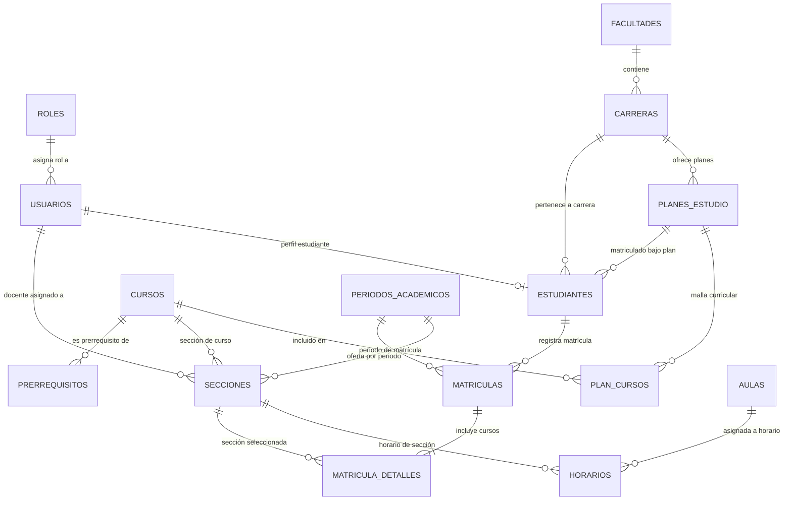

# Diagrama Entidad-Relación - Sistema de Matrícula UNJBG

## Diagrama Conceptual / Mermaid

## Relación de Tablas Principales

| Tabla | Descripción | Llave Primaria | Claves Foráneas |
|---|---|---|---|
| `roles` | Catálogo de roles de usuario | `id` | - |
| `usuarios` | Cuentas y credenciales del sistema | `id` | `rol_id` -> `roles(id)` |
| `facultades` | Facultades universitarias | `id` | - |
| `carreras` | Escuelas profesionales | `id` | `facultad_id` -> `facultades(id)` |
| `planes_estudio` | Planes de estudio y mallas | `id` | `carrera_id` -> `carreras(id)` |
| `estudiantes` | Registro de alumnos | `id` | `usuario_id`, `carrera_id`, `plan_estudio_id` |
| `cursos` | Catálogo maestro de asignaturas | `id` | - |
| `plan_cursos` | Asignación de curso a plan y ciclo | `id` | `plan_estudio_id`, `curso_id` |
| `prerrequisitos` | Cursos requisito por plan | `id` | `plan_curso_id`, `curso_requisito_id` |
| `periodos_academicos` | Semestres académicos | `id` | - |
| `aulas` | Espacios físicos / laboratorios | `id` | - |
| `secciones` | Oferta de cursos por periodo | `id` | `periodo_id`, `curso_id`, `docente_id` |
| `horarios` | Días y horas por sección | `id` | `seccion_id`, `aula_id` |
| `matriculas` | Cabecera del registro de matrícula | `id` | `estudiante_id`, `periodo_id` |
| `matricula_detalles` | Cursos matriculados por estudiante | `id` | `matricula_id`, `seccion_id` |
